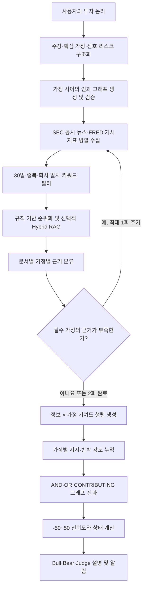

# ThesisGuard의 정보 수집 및 점수 산출 방식

> 이 문서는 현재 저장소에 구현된 코드를 기준으로, 컴퓨터공학·데이터과학·금융 관련 전공생이 전체 동작을 이해할 수 있도록 설명한다. 기획 의도보다 실제 코드의 동작을 우선한다.

## 1. 먼저 알아야 할 핵심

ThesisGuard는 주가가 올랐는지, 뉴스 분위기가 긍정적인지만 보고 점수를 매기지 않는다. 사용자가 등록한 **투자 논리(Thesis)**를 여러 핵심 가정으로 나누고, 새 정보가 각 가정을 지지하는지 또는 반박하는지를 평가한 뒤, 그 결과를 인과 그래프를 따라 합쳐 -50~50점의 신뢰도 점수를 계산한다.

이 과정에는 서로 목적이 다른 두 종류의 점수가 등장한다.

| 점수 | 목적 | 최종 신뢰도에 직접 포함되는가? |
|---|---|---|
| `selection_score` | 수집한 문서 중 분석할 문서를 고르는 검색 점수 | 아니요 |
| `confidence_score` | 현재 투자 논리가 근거에 의해 얼마나 유지되는지를 나타내는 -50~50점 | 예 |

즉, 검색 점수가 높은 뉴스라고 해서 투자 논리 점수가 바로 오르는 것은 아니다. 검색 점수는 문서를 **읽을 후보로 선택**할 때만 사용하고, 최종 점수는 선택된 문서가 투자 논리의 각 가정에 미치는 영향을 별도로 판정해 계산한다.

## 2. 전체 처리 흐름

초기 분석은 모든 핵심 가정을 검색 대상으로 삼는다. 첫 번째 수집 후에도 필요한 가정에 유효한 근거가 없으면, 해결되지 않은 가정만 검색어로 사용해 한 번 더 수집한다. 따라서 한 분석 요청에서 연구 라운드는 기본적으로 최대 2회다.

## 3. 분석의 출발점: 투자 논리 구조화

사용자가 자연어로 입력한 투자 논리는 다음 항목으로 구조화된다.

- `main_thesis`: 최상위 투자 주장
- `key_assumptions`: 주장이 성립하기 위해 검증해야 할 핵심 가정
- `positive_signals`: 가정을 지지할 수 있는 관찰 신호
- `negative_signals`: 가정을 약화할 수 있는 관찰 신호
- `key_risks`: 주요 실패 요인
- `logic_graph`: 핵심 가정과 최상위 주장 사이의 인과 관계

새 투자 논리는 근거가 아직 없으므로 `confidence_score = 0`, 상태는 `UNCHANGED`에서 시작한다. 0점은 “좋다” 또는 “나쁘다”가 아니라 **지지와 반박이 아직 어느 쪽으로도 기울지 않은 중립 기준점**이다.

인과 그래프는 LLM이 초안을 만들지만, 코드는 다음 조건을 다시 검증한다.

- 루트는 하나의 `CLAIM` 노드여야 한다.
- 모든 핵심 가정은 정확히 한 번씩 `ASSUMPTION` 말단 노드로 들어가야 한다.
- 모든 노드는 루트에서 연결되어야 하며 순환이 없어야 한다.
- `CLAIM`에는 연산자와 자식 노드가, `ASSUMPTION`에는 원문 가정이 있어야 한다.

검증에 실패하면 모든 가정이 동일하게 기여하는 `CONTRIBUTING` 그래프로 안전하게 대체한다. 투자 논리를 새로 만들거나 재설정하면 누적 점수도 다시 0점에서 시작한다.

## 4. 정보를 어디에서 가져오는가

### 4.1 점수 분석에 사용하는 세 가지 출처

| 출처 | 실제 데이터 원천 | 가져오는 정보 | 주요 제한 |
|---|---|---|---|
| SEC 공시 | SEC EDGAR | 최근 `10-Q`, `10-K`, `8-K` | 발행일이 분석 시점 기준 30일 이내여야 함 |
| 뉴스 | Bing News RSS, 결과가 없으면 Google News RSS | 회사 및 핵심 가정 관련 기사 | 날짜 확인 필수, 30일 이내, 기본 후보 최대 15개 |
| 거시지표 | FRED CSV | `FEDFUNDS`, `DGS10`, `CPIAUCSL`의 최신 값 | 투자 논리에 금리·물가·국채 등 거시 관련성이 있을 때만 선택 |

대부분의 수집 함수는 인증 키 없이 공개 엔드포인트를 사용한다. 다만 SEC는 정책상 식별 가능한 `User-Agent`를 보내야 한다.

### 4.2 시세 데이터는 현재 점수 입력이 아니다

Yahoo Finance의 공개 Chart API에서는 현재가, 일별 가격 이력, 30일 변화율을 가져온다. 그러나 이 값은 현재 `ResearchTools` 분석 경로에 연결되어 있지 않고 대시보드용 시장 스냅샷으로만 사용된다.

따라서 현재 구현에서는 다음과 같이 해석해야 한다.

> 주가가 30% 올랐다는 사실만으로 투자 논리 점수가 오르지 않는다. 그 상승의 원인이 공시·뉴스·거시 근거에 나타나고, 그 근거가 핵심 가정을 지지한다고 판정될 때만 점수에 영향을 줄 수 있다.

## 5. 출처별 수집 과정

### 5.1 SEC 공시

1. 티커를 SEC의 CIK와 정식 회사명으로 변환한다.
2. EDGAR submissions API에서 `10-Q`, `10-K`, `8-K`만 가져온다.
3. 가능한 경우 세 양식에서 최신 문서를 하나씩 먼저 선택하고, 남는 자리는 최신순으로 채운다.
4. 최대 9개 후보를 가져오되, 날짜가 없거나 30일을 넘은 공시는 본문을 내려받기 전에 제외한다.
5. HTML에서 텍스트만 추출하고 원문은 최대 120,000자로 제한한다.
6. 투자 논리 키워드와 겹치는 문단을 우선해 최대 6,000자로 압축한다.

공시 원문이 너무 길기 때문에 전체 문서를 그대로 LLM에 보내지 않고, 핵심 가정·긍정 신호·부정 신호·리스크와 단어가 겹치는 문단을 우선 선택한다.

### 5.2 뉴스

뉴스 검색어는 SEC의 정식 회사명과 티커를 기본으로 사용한다. 여기에 현재 집중해야 할 핵심 가정을 최대 4개까지 추가해 여러 검색을 병렬 실행한다.

가정에 특정 주제가 포함되면 다음과 같은 영어 금융 검색 힌트를 붙인다.

| 가정의 주제 | 추가 검색 힌트 |
|---|---|
| 경쟁사·경쟁 제품 | `competing app` |
| 시장·산업 성장 | `market industry growth` |
| 매출·이익·실적 | `revenue earnings growth` |

검색 결과는 다음 순서로 정리한다.

1. Bing News RSS에서 상세 설명과 발행사 링크를 가져온다.
2. Bing 결과가 없으면 Google News RSS를 사용한다.
3. 발행일이 없거나 30일 밖이거나 미래 날짜인 기사는 제외한다.
4. URL과 제목이 같은 기사를 중복 제거한다.
5. 발행사 본문을 직접 읽을 수 있으면 본문을 가져온다.
6. 동적 페이지, 차단 페이지, 유료벽 등으로 본문을 가져오지 못하거나 정제된 본문이 400자 미만이면 RSS 요약으로 대체한다.
7. 가져온 본문도 투자 논리 관련 문단 중심으로 최대 6,000자까지 줄인다.

### 5.3 거시지표

FRED에서 다음 세 시계열의 가장 최근 유효 값을 읽는다.

- `FEDFUNDS`: 미국 연방기금 실효금리
- `DGS10`: 미국 10년물 국채 수익률
- `CPIAUCSL`: 미국 소비자물가지수

거시지표는 항상 수집을 시도하지만, 투자 논리나 검색 초점에 `금리`, `국채`, `물가`, `인플레이션`, `환율`, `rate`, `yield`, `CPI` 등 관련 표현이 있을 때만 최종 후보로 남긴다. 시계열의 관측일과 값은 문서 본문과 `document_id`에 포함된다.

## 6. 수집한 문서 중 무엇을 읽을지 고르는 방법

### 6.1 1차 규칙 필터

문서는 다음 조건을 만족해야 한다.

- 제목과 본문이 비어 있지 않아야 한다.
- 공시와 뉴스는 확인 가능한 발행일이 있고 30일 이내여야 한다.
- SEC 정식 회사명이 확인된 뉴스는 본문 또는 제목에 그 회사명을 구성하는 주요 토큰이 있어야 한다.
- 과거 분석에서 이미 처리한 `document_id` 또는 정규화된 URL과 같지 않아야 한다.
- 현재 수집 묶음 안에서도 문서 ID, 추적 파라미터를 제거한 URL, 충분히 긴 정규화 제목이 중복되지 않아야 한다.
- 거시지표는 투자 논리에 거시 관련성이 있어야 한다.

### 6.2 규칙 기반 `selection_score`

각 후보의 검색 점수는 다음 식으로 계산한다.

\[
S_{select} = \min\left(1, B_{source} + \min(0.35, 1.5O) + 0.15T + 0.25C + 0.15F\right)
\]

- \(B_{source}\): 출처 기본값
  - SEC·IR·실적 자료: 0.45
  - 뉴스: 0.10
  - 거시지표: 0.05
- \(O\): 투자 논리 검색 토큰과 문서 토큰의 겹침 비율. 분모에 사용하는 검색 토큰은 최대 12개다.
- \(T\): 티커가 제목이나 본문에 있으면 1, 아니면 0
- \(C\): 정식 회사명 주요 토큰이 문서에 있으면 1, 아니면 0
- \(F\): 뉴스의 최신성. 당일에 가까울수록 1, 30일 경계에 가까울수록 0

뉴스는 이 점수가 0.30 미만이면 Evidence 분류기로 보내지 않는다. 이 임계치는 **문서 선택용**일 뿐, 최종 신뢰도 점수의 30점 기준을 의미하지 않는다.

### 6.3 Hybrid RAG가 켜져 있을 때

RAG 임베딩 제공자와 API 키가 설정되어 있으면 규칙 기반 상위 후보를 최종 개수의 3배까지 남긴 뒤 한 번 더 정렬한다. OpenAI와 Upstage 임베딩을 지원하며, 기본 설정은 OpenAI `text-embedding-3-small`이다.

1. 문서를 1,400자 청크로 나누고 앞뒤 청크가 200자씩 겹치게 한다.
2. 핵심 가정·주장·신호·리스크에서 최대 6개의 독립 검색 질의를 만든다.
3. 의미 유사도를 보는 Dense cosine 검색과 정확한 단어 겹침을 보는 BM25 검색을 각각 수행한다.
4. 각 검색 순위를 RRF(Reciprocal Rank Fusion)로 합친다. 한 질의에서 순위가 \(r\)이면 기본 기여도는 \(1/(60+r)\)이다.
5. Dense 점수가 해당 질의 최고점의 20%보다 낮은 후보와 검색 링크만 나열한 저정보 페이지를 제외한다.
6. 최고 결합 점수의 65%보다 낮은 후보는 개수를 채우기 위해 억지로 선택하지 않는다.
7. MMR을 사용해 관련도는 높이고 비슷한 기사 반복은 줄인다. 관련도 가중치는 0.75, 중복 억제 가중치는 0.25다.
8. 문서 하나에서 최대 2개 청크를 고르고, 선택 청크의 앞뒤 청크를 다시 붙여 문맥을 복원한다.

최종 기본 상한은 공시 3개, 뉴스 5개, 거시지표 2개다. RAG가 꺼져 있거나 임베딩 키가 없으면 규칙 기반 순위만 사용한다. 임베딩 호출 중 오류가 나도 분석을 중단하지 않고 같은 상한의 규칙 기반 결과로 자동 전환한다.

## 7. 문서를 점수 계산이 가능한 근거로 바꾸는 방법

선택된 문서는 정제 후 최대 500자짜리 번호 구간 20개로 나뉜다. LLM은 문서 전체와 과거 맥락을 읽고 다음 두 수준의 결과를 만든다.

### 7.1 문서 전체 판정

| 분류 | 의미 |
|---|---|
| `SUPPORT` | 문서가 투자 논리의 하나 이상의 가정을 지지함 |
| `CONTRADICT` | 문서가 하나 이상의 가정을 반박함 |
| `NEUTRAL` | 관련은 있을 수 있으나 방향성 판단에 충분하지 않음 |
| `UNCERTAIN` | 원문·출처·모델 출력 등을 신뢰할 수 없어 판단을 보류함 |

### 7.2 각 핵심 가정별 판정

한 문서라도 가정마다 효과가 다를 수 있으므로 모든 `문서 × 핵심 가정` 조합을 평가한다.

| 가정별 판정 | 점수 처리 |
|---|---|
| `SUPPORT` | 양의 방향으로 반영 |
| `CONTRADICT` | 음의 방향으로 반영 |
| `MIXED` | 현재 계산식에서는 방향 강도 0 |
| `NOT_ADDRESSED` | 해당 가정을 다루지 않으므로 0 |

각 가정 판정에는 영향도 `HIGH`·`MEDIUM`·`LOW`, 관련도 0~1, 판단 이유, 근거 원문 구간 번호가 함께 저장된다. “문서에 가정이 언급되지 않았다”는 사실은 반박이 아니라 반드시 `NOT_ADDRESSED`로 처리한다.

### 7.3 신뢰 코드를 통과해야 점수에 들어간다

LLM의 구조화 출력은 그대로 점수에 넣지 않고 다음 규칙으로 검증한다.

- `SUPPORT` 또는 `CONTRADICT` 가정 판정에 원문 구간 번호가 없으면 `NOT_ADDRESSED`, `LOW`, 관련도 0으로 바꾼다.
- 가정별 관련도가 0.55 미만인 방향성 판정은 `NOT_ADDRESSED`로 바꾼다.
- 문서 전체 방향성 관련도가 0.55 미만이면 문서 판정을 `NEUTRAL/LOW`로 낮춘다.
- 존재하지 않는 원문 구간 번호를 인용하면 문서 전체를 `UNCERTAIN/LOW`, 관련도 0으로 처리한다.
- 방향성 근거에는 실제 `source_url` 또는 `vector_doc_id`가 반드시 있어야 한다. 둘 다 없으면 모든 방향성 판정을 제거한다.
- 모델 호출은 기본 2회까지 시도한다. 모두 실패하면 해당 문서는 `UNCERTAIN/LOW`, 관련도 0이 된다.

따라서 LLM은 근거의 의미를 해석하지만, **어떤 출력이 실제 점수에 들어갈 수 있는지는 결정론적 코드가 통제**한다.

## 8. 점수 산출 공식

### 8.1 1단계: 문서 하나가 가정 하나에 주는 방향 강도

영향도를 다음 고정 가중치로 변환한다.

| 영향도 | 가중치 \(W\) |
|---|---:|
| `LOW` | 0.09 |
| `MEDIUM` | 0.27 |
| `HIGH` | 0.54 |

문서 \(e\)가 가정 \(a\)에 주는 부호 있는 강도는 다음과 같다.

\[
x_{e,a} = D \times W \times R
\]

- \(D=+1\): `SUPPORT`
- \(D=-1\): `CONTRADICT`
- \(D=0\): `MIXED` 또는 `NOT_ADDRESSED`
- \(R\): 관련도 0~1

예를 들어 `HIGH`, 관련도 0.8인 지지 근거는 \(+1 \times 0.54 \times 0.8 = +0.432\)다. `MEDIUM`, 관련도 0.7인 반박 근거는 \(-1 \times 0.27 \times 0.7 = -0.189\)다.

### 8.2 2단계: 같은 방향의 여러 근거를 한계효과 감소 방식으로 결합

같은 가정에 지지 근거가 여러 개 있다고 단순 합산하면 비슷한 정보가 많을수록 쉽게 1을 넘는다. 이를 막기 위해 기존 강도 \(b\)와 새 독립 근거 강도 \(x_i\)를 다음과 같이 결합한다.

\[
C_{new} = 1 - (1-b)\prod_i(1-x_i)
\]

예를 들어 관련도 1인 `HIGH` 지지 근거 두 개의 개별 강도는 각각 0.54지만, 합계 1.08이 아니라 다음처럼 0.7884가 된다.

\[
1-(1-0)(1-0.54)^2 = 0.7884
\]

지지 강도와 반박 강도는 서로 상쇄해 없애지 않고 **두 축으로 따로 누적**한다.

\[
state_a = support_a - contradict_a
\]

수치상 차이가 0이어도 지지와 반박이 둘 다 존재하면 판정은 `CONFLICTING`으로 남는다.

### 8.3 3단계: 인과 그래프를 따라 상위 주장으로 전파

각 `CLAIM` 노드는 자식의 지지 축과 반박 축을 다음 규칙으로 합친다.

| 연산자 | 의미 | 지지 강도 | 반박 강도 |
|---|---|---:|---:|
| `AND` | 모든 조건이 필요 | 자식 중 최솟값 | 자식 중 최댓값 |
| `OR` | 어느 하나면 충분 | 자식 중 최댓값 | 자식 중 최솟값 |
| `CONTRIBUTING` | 각 조건이 독립적으로 기여 | 자식 평균 | 자식 평균 |

`AND`에서 가장 약한 필수 조건이 전체 지지를 제한하고, 하나의 강한 반박만 있어도 전체 반박이 커진다. 반대로 `OR`에서는 가장 강한 대안이 전체 지지를 살리고, 모든 대안이 반박되어야 전체 반박이 커진다.

루트에서 다음 값을 계산한다.

\[
root\_state = root\_support - root\_contradict
\]

### 8.4 4단계: 루트 상태를 -50~50점으로 변환

\[
health\_score = round_{half\_up}(50 \times root\_state)
\]

결과는 -50~50 범위로 제한한다.

- `root_state = -1`이면 -50점
- `root_state = 0`이면 0점
- `root_state = +1`이면 50점

Python의 일반적인 은행가 반올림이 아니라 0.5를 절댓값이 큰 쪽으로 올리는 `ROUND_HALF_UP`을 사용한다.

### 8.5 5단계: 이번 분석의 변화량으로 상태 결정

\[
score\_delta = health\_score - previous\_score
\]

| 이번 분석의 변화량 | 상태 |
|---:|---|
| +15 이상 | `STRONGLY_STRENGTHENED` |
| +5 이상 +14 이하 | `STRENGTHENED` |
| -4 이상 +4 이하 | `UNCHANGED` |
| -14 이상 -5 이하 | `WEAKENED` |
| -15 이하 | `STRONGLY_WEAKENED` |

상태는 절대 점수보다 **이번 분석에서 얼마나 변했는지**를 나타낸다. 예를 들어 신뢰도 30점을 유지하면서 새 점수 변화가 0이면 상태는 `UNCHANGED`다.

## 9. 계산 예시

세 핵심 가정이 `CONTRIBUTING`으로 연결되어 있고 이전 점수가 0점이라고 하자.

| 가정 | 새 근거 판정 | 계산 | 지지 | 반박 |
|---|---|---:|---:|---:|
| A: 수요가 성장한다 | `HIGH SUPPORT`, 관련도 0.8 | \(0.54\times0.8\) | 0.432 | 0 |
| B: 마진이 유지된다 | `MEDIUM CONTRADICT`, 관련도 0.7 | \(0.27\times0.7\) | 0 | 0.189 |
| C: 경쟁 우위가 유지된다 | `NOT_ADDRESSED` | 0 | 0 | 0 |

`CONTRIBUTING`은 평균을 사용하므로 다음과 같다.

\[
root\_support=(0.432+0+0)/3=0.144
\]

\[
root\_contradict=(0+0.189+0)/3=0.063
\]

\[
root\_state=0.144-0.063=0.081
\]

\[
health\_score=round(50\times0.081)=4
\]

이전 점수가 0점이므로 변화량은 +4점이고 상태는 `UNCHANGED`다. 다만 루트에는 지지와 반박이 모두 있으므로 근거 판정은 `CONFLICTING`이며, 방향성 근거가 있는 가정은 A와 B 두 개이므로 근거 충족도는 66.7%다.

이 예시는 다음을 보여 준다.

- 최종 숫자가 0점보다 높아도 지지와 반박이 동시에 존재할 수 있다.
- 점수가 올랐더라도 +5 미만이면 상태는 `UNCHANGED`다.
- 근거가 없는 가정은 반박으로 계산하지 않고 0으로 남긴다.

## 10. 같은 사실을 여러 번 세지 않는 방법

중복 방지는 세 단계로 이루어진다.

1. **수집 단계**: 같은 문서 ID, 정규화 URL, 제목을 제거한다.
2. **분석 이력 단계**: 과거에 처리한 문서 ID와 URL은 다음 분석의 후보에서 제외한다.
3. **점수 단계**: 서로 다른 기사라도 같은 사건을 보도한 것으로 보이면 하나의 독립 근거만 남긴다.

사건 중복 판정은 방향, 발행일, 한국어·영어 단어와 숫자를 반영한 SimHash를 사용한다. 발행일 차이가 7일 이내이고 내용 지문이 충분히 가까우면 같은 사건으로 보며, 같은 사건 안에서는 절대 강도가 가장 큰 근거 하나만 사용한다. 같은 85억 달러 실적 발표를 여러 언론사가 반복 보도해도 점수가 기사 수만큼 오르지 않는 이유다.

과거 근거 요약은 LLM이 사건의 맥락을 이해하는 데만 사용한다. 과거 근거 자체는 이미 이전 점수에 반영되어 있으므로 이번 관련도·영향도·점수를 다시 키우는 데 사용할 수 없다. 새 점수는 “이전 가정별 누적 상태 + 이번에 처음 들어온 독립 정보”로 다시 계산한다.

## 11. 정보별 점수 변화는 어떻게 설명하는가

인과 그래프와 한계효과 감소식은 비선형이므로 문서별 점수 변화를 단순히 개별 강도에 50을 곱해 구할 수 없다. ThesisGuard는 각 문서가 여러 순서로 들어왔다고 가정하고, 그때마다 생기는 한계 점수 변화를 평균내는 Shapley 방식으로 기여도를 배분한다.

- 활성 문서가 7개 이하면 가능한 모든 입력 순서를 계산한다.
- 8개 이상이면 고정된 시드로 최대 128개 순서를 표본 추출한다.
- 문서별 기여도는 소수 둘째 자리까지 저장한다.
- 반올림 오차를 보정해 문서별 `score_delta`의 합이 실제 전체 `score_delta`와 일치하게 한다.

이 값은 “이 기사가 원래 +3점짜리다”라는 고정 속성이 아니라, **현재의 다른 근거와 인과 그래프가 함께 있을 때 이 문서가 전체 변화에 기여한 몫**이다.

## 12. `BROKEN` 하드 게이트

숫자 점수와 별개로, 논리적으로 반드시 필요한 가정이 반복해서 강하게 무효화되면 상태를 `BROKEN`으로 고정한다.

발동 조건은 다음과 같다.

1. 해당 가정이 루트에서 그 가정까지 모두 `AND`로 이어지는 필수 가정이어야 한다.
2. 서로 독립적인 새 근거가 `HIGH CONTRADICT`이고 관련도가 0.75 이상이어야 한다.
3. 해당 가정의 누적 반박 강도가 지지 강도보다 커야 한다.
4. 서로 다른 분석 회차에서 이 조건이 두 번 확인되어 무효화 streak가 2에 도달해야 한다.

같은 문서를 다시 분석하거나 같은 사건을 반복 보도한 기사는 streak를 올리지 않는다. 새 근거가 없는 분석은 기존 streak를 유지한다. 한 번 `BROKEN`이 되면 이후 지지 근거가 생겨도 자동 해제되지 않으며, 사용자가 투자 논리를 재설정해야 초기화된다.

## 13. Bull·Bear·Judge의 역할과 점수의 관계

근거 분류 후 Bull Agent, Bear Agent, 점수 엔진이 병렬로 실행된다.

- Bull Agent: `SUPPORT`이면서 영향도가 `MEDIUM/HIGH`인 근거 중심으로 긍정 논리를 설명한다.
- Bear Agent: `CONTRADICT`이면서 영향도가 `MEDIUM/HIGH`인 근거 중심으로 위험 논리를 설명한다.
- 점수 엔진: 위에서 설명한 고정 수식으로 점수와 상태를 계산한다.
- Judge Agent: Bull·Bear 설명과 계산 결과를 읽고 사용자용 설명을 생성한다.

중요한 점은 Judge가 점수나 상태를 수정할 수 없다는 것이다. Judge 호출이 실패해도 결정론적으로 계산한 점수와 상태는 그대로 유지된다.

## 14. 실패와 예외 처리

| 실패 상황 | 처리 방식 |
|---|---|
| 한 외부 데이터 소스가 응답하지 않음 | 해당 소스만 비우고 다른 출처로 분석 계속 |
| 뉴스 본문 접근 실패 | RSS 설명으로 대체 |
| 임베딩 키 없음 또는 RAG 오류 | 규칙 기반 Source Selector로 전환 |
| 분류 모델 2회 실패 | 해당 문서를 `UNCERTAIN/LOW`, 관련도 0으로 처리 |
| 유효한 방향성 근거가 없음 | 이전 가정 상태와 점수 유지 |
| 필수 가정 근거 부족 | 해결되지 않은 가정에 집중해 1회 추가 수집 |
| 추가 수집 후에도 부족 | 부족 상태를 표시하고 현재 근거만으로 계산 진행 |

이 구조는 일부 API나 모델이 실패했을 때 근거 없는 숫자를 만들어 채우는 대신, 실패한 정보의 영향력을 0으로 두고 확인 가능한 정보만 반영한다.

## 15. 결과를 읽는 방법

최종 화면이나 API 응답에서는 다음 항목을 함께 봐야 한다.

- `confidence_score`: 누적 근거를 인과 그래프에 전파한 -50~50점
- `status`: 이번 분석에서 이전 점수 대비 얼마나 변했는지
- `root_support_strength`, `root_contradict_strength`: 루트의 지지·반박 축
- `root_verdict`: `SUPPORTED`, `REFUTED`, `CONFLICTING`, `INSUFFICIENT` 중 하나
- `coverage_percent`: 전체 핵심 가정 중 방향성 근거가 확보된 가정의 비율
- `assumption_scores`: 가정별 지지·반박·상태·근거 이력
- `evidence_impacts`: 각 정보에 귀속된 점수 변화와 가정별 기여도
- `is_broken`, `invalidated_assumptions`: 필수 가정 무효화 여부와 대상

점수 하나만 보면 상충 근거나 근거 부족을 놓칠 수 있다. 예를 들어 0점은 완전한 중립일 수도 있고, 강한 지지와 강한 반박이 정확히 상쇄된 결과일 수도 있다. 따라서 `root_verdict`와 `coverage_percent`를 항상 함께 확인해야 한다.

또한 이 점수는 주가 상승 확률이나 수익률 예측값이 아니다. 현재 구현의 고정 규칙 안에서 “등록된 투자 논리가 수집된 근거에 의해 얼마나 지지 또는 반박되는가”를 비교하기 위한 내부 상태 지수다.

## 16. 코드 위치

| 기능 | 구현 파일 |
|---|---|
| 전체 LangGraph 워크플로 | [`agents/graph.py`](../agents/graph.py) |
| 수집 설정과 기본 상한 | [`agents/runtime.py`](../agents/runtime.py) |
| 백엔드 수집 어댑터 | [`backend/src/thesisguard_backend/agent_adapters.py`](../backend/src/thesisguard_backend/agent_adapters.py) |
| SEC·뉴스·거시·시세 커넥터 | [`backend/src/thesisguard_backend/mcp_tools/`](../backend/src/thesisguard_backend/mcp_tools/) |
| 규칙 기반 후보 필터와 검색 점수 | [`agents/retrieval.py`](../agents/retrieval.py) |
| Hybrid RAG | [`agents/rag.py`](../agents/rag.py) |
| 근거 분류와 검증 | [`agents/nodes/evidence.py`](../agents/nodes/evidence.py) |
| LLM 근거 분류 지침 | [`agents/model.py`](../agents/model.py) |
| 인과 그래프 검증·전파 | [`agents/logic_graph.py`](../agents/logic_graph.py) |
| 결정론적 점수·중복 사건·Shapley 귀속 | [`agents/scoring.py`](../agents/scoring.py) |
| 점수 회귀 테스트 | [`tests/test_scoring.py`](../tests/test_scoring.py) |

## 17. 한 문장 정리

ThesisGuard의 점수는 **새 공시·뉴스·거시정보를 투자 논리의 각 핵심 가정과 근거 구간 단위로 대조하고, 검증을 통과한 방향·영향도·관련도를 누적한 뒤, AND·OR·CONTRIBUTING 인과 그래프를 통해 최상위 주장으로 전파해 계산한 결정론적 신뢰도**다.
